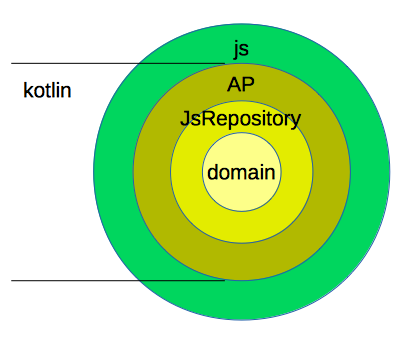

kotlinでゲームを作ってみようと思う
====================
明けましておめでとうございます。
新年早々ゲームが作りたい衝動にかられていろいろ考えています。


## プラットーフォームの選定
最初に問題になるのがプラットーフォームの選定。
androidなのか〜iphoneなのか〜webなのか〜。
けどUnityはなんとなくやだなぁ〜。

そうなると落としどころは
java + LibGDXでandroid用に作るか
js + phaserでweb用に作るかの2択か。
正直、今の段階では決められないっす。。

javaでもjsでも作れると言えば...
kotlinはjsのコードも吐ける謎機能があるからそれで作っちゃおう！
とりあえず当面のターゲットは実行しやすいjsで。
ただ設計としては、いつでもjavaにコンバートできるようにしよう。

## プラットフォームを変更し易い設計
まずこうゆうaltjsを使う時の個人的な流儀は、100%altjsで作らないことです。
ライブラリにガッツリ依存してる部分はjsで書いた方イイっす。
altjsからjsライブラリを触るための定義ファイルに時間を費やすのは本質的じゃないし、
それをやったところでどれだけaltjsの恩恵を受けれるかって考えたらムダでしかないので。
それを加味して、ゲーム用オニオンアーキテクチャを考えてみた。

## ゲーム用オニオンアーキテクチャ
個人的にオニオンアーキテクチャがすきです。
このザックリ感がちょうどイイ。
今回考えたのはこんな感じ。

一番外側からJS層、AP層、JsRepository層、domain層があります。
AP層より内側はkotlinで実装するイメージ。

## js層
ここはjsで実装します。
ゲームライブラリを弄ったり、AP層を呼び出したります。
一番外側なので何やってもイイんですが、
この層が薄ければ薄いほど、今後のプラットフォーム移植がし易くなります。

## AP層
jsとのインターフェースになる層です。
jsから呼び出されたり、JsRepository層を介してjsを呼び出したりします。

## JsRepository層
ここは基本的には実装の無いインターフェースが入ります。
そのインターフェースをJSが実装するイメージ。
仮にココに実装があるとしたら
kotlinのオブジェクトをjsで使い易いように加工する程度の処理だと思う。たぶん。

## domain層
ゲームのルールに当たる部分。
とにかくココを太らせればイイコードになる。

## いざコーディング
まずkotlinがどんなjsを吐くのかを調べました。

```
interface AlertJsRepository {
    fun show(text: String)
}
```
こんな感じのインターフェースがjsになるとどんなメソッド名になるか。
```
show_61zpoe$(text)
```
こうなった。。メソッドにへんなハッシュ値付いた。。ピュアな名前になってくれよ。。
どうやらアノテーションで名前を制御できるっぽい
```
interface AlertJsRepository {
    @JsName("show")
    fun show(text: String)
}
```
もういきなり妥協する展開。
しかもこのJsNameってアノテーションはjsのライブラリにしか定義されてないので
java用にビルドする時は消してあげないと「JsNameなんて知らねぇし！」て怒られます。。
つらい。。
Haxeにしとけばよかったかな。。

## サンプルコード
オニオンアーキテクチャに従ってアラートが出るコードを書いてみた。
要点はこんな感じ。

koltin
```
class ShowPositionService(val alertJsRepository: AlertJsRepository) {
    fun invoke() {
        val p = Position(40.5, 30.1)
        alertJsRepository.show("${p.x}, ${p.y}");
    }
}
```

js
```
// alias
var kotlinjsgame = app.com.naosim.kotlinjsgame;

// implements AlertJsRepository
var alertJsRepositoryImpl = { show:(text) => alert(text) };
// create service
var service = new kotlinjsgame.ap.ShowPositionService(alertJsRepositoryImpl);
// run
service.invoke();
```

js側でAlertJsRepositoryの実装をしてサービスに注入します。
最終的にinvoke()のタイミングでアラートが表示されます。
動作は[ココ](https://naosim.github.io/kotlinjsgame/web/)で確認できます。
※ただし随時更新していくのでそのうち上記の動作ではなくなると思います。

## まとめ
- 設計のコンセプトを作った
- kotlinから生成されるjsがピュアじゃなくて残念
- とりあえず動いた

次回はphaserを入れてスプライトを動かしてみたいな。